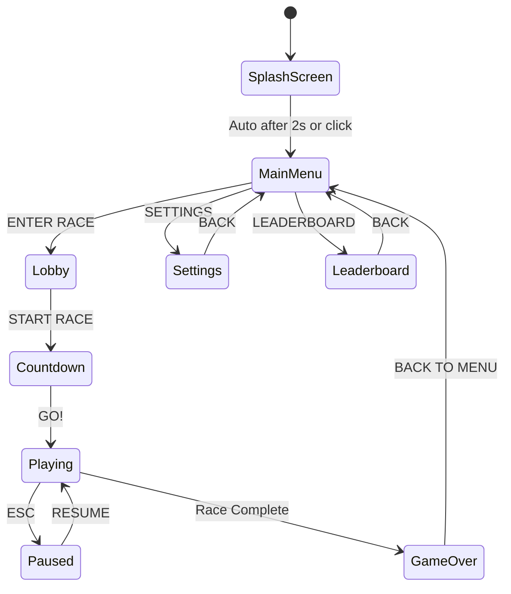

# Splash Screen and Main Menu Architecture Plan

## Overview

This document outlines the architecture for implementing a retro-styled splash screen and main menu for microRacer2, inspired by the original microRacer's design.

## Current State Analysis

### Original microRacer Features
- **Visual Style**: Retro arcade aesthetic with Press Start 2P and Orbitron fonts
- **Effects**: Scanline overlay, checkered racing stripe decorations, animated glowing title
- **Color Theme**: Orange/dark theme with #ff6600 as primary accent
- **Menu Structure**:
  - Main menu with player count selector (1-4 players)
  - Track selector with navigation arrows
  - Controls info panel (keyboard/gamepad)
  - Settings screen (ghost, music, SFX toggles)
  - Leaderboard screen with track records

### Current microRacer2 State
- **Visual Style**: Modern neon aesthetic with Inter font
- **Color Theme**: Cyan/magenta theme (#00ffcc, #ff00ff)
- **Menu Structure**:
  - Main menu → Lobby → Countdown → Game
  - Player join system via keyboard/gamepad input
  - Volume controls in pause menu
  - Ghost toggle in pause menu

## Proposed Architecture

### Design Philosophy
Merge the retro arcade aesthetic of the original with the existing lobby-based multiplayer system of microRacer2. This creates a unique "neon retro" style that honors both designs.

### Visual Style Changes

```
┌─────────────────────────────────────────────────────────────┐
│                    COLOR PALETTE                            │
├─────────────────────────────────────────────────────────────┤
│  Primary Accent:    #ff6600 (orange - from original)        │
│  Secondary Accent:  #ffcc00 (yellow - highlights)           │
│  Background:        #0a0a0a (near black)                    │
│  Text Primary:      #ffffff (white)                         │
│  Text Secondary:    #888888 (gray)                          │
│  Success/Start:     #22cc22 (green)                         │
│  Player Colors:     #00ffcc, #ff00ff (kept from current)    │
└─────────────────────────────────────────────────────────────┘
```

### Font Stack
```css
/* Primary: Retro pixel font for titles and labels */
font-family: 'Press Start 2P', monospace;

/* Secondary: Futuristic font for body text */
font-family: 'Orbitron', sans-serif;
```

### Menu Flow Diagram



### Screen Components

#### 1. Splash Screen (NEW)
```
┌────────────────────────────────────────────────┐
│                                                │
│         ╔═══════════════════════════╗          │
│         ║   microRacer 2            ║          │
│         ║   NEON DRIFT              ║          │
│         ╚═══════════════════════════╝          │
│                                                │
│            [Animated car sprite]               │
│                                                │
│              Click to Start                    │
│                                                │
│         ◢◣                        ◢◣          │
└────────────────────────────────────────────────┘
```

**Features:**
- Large animated title with glow effect
- Animated car sprite or particle effects
- Auto-transition to main menu after 2 seconds
- Click anywhere to skip

#### 2. Main Menu (REDESIGNED)
```
┌────────────────────────────────────────────────┐
│  ╔════════════════════════════════════════╗    │
│  ║     microRacer 2: NEON DRIFT           ║    │
│  ╚════════════════════════════════════════╝    │
│           Top-down arcade racing               │
│                                                │
│  ┌─────────────────────────────────────────┐   │
│  │ SELECT PLAYERS                          │   │
│  │  [1]  [2]  [3]  [4]                     │   │
│  └─────────────────────────────────────────┘   │
│                                                │
│  ┌─────────────────────────────────────────┐   │
│  │ SELECT TRACK                            │   │
│  │  ◄  [1/5 - Neon Circuit]  ►            │   │
│  └─────────────────────────────────────────┘   │
│                                                │
│           [ START RACE ]                       │
│                                                │
│      [SETTINGS]    [LEADERBOARD]              │
│                                                │
│  ┌──────────────────┬──────────────────┐      │
│  │ Player 1         │ Player 2         │      │
│  │ ↑ ↓ ← →          │ W A S D          │      │
│  └──────────────────┴──────────────────┘      │
│         Click to toggle controller             │
└────────────────────────────────────────────────┘
```

**Features:**
- Player count selector (1-4 players)
- Track selector with left/right navigation
- Controls info panel showing keyboard mappings
- Controller mode indicator (blue highlight when gamepad detected)
- Settings and Leaderboard buttons

#### 3. Settings Screen (NEW)
```
┌────────────────────────────────────────────────┐
│  ╔════════════════════════════════════════╗    │
│  ║           SETTINGS                     ║    │
│  ╚════════════════════════════════════════╝    │
│                                                │
│  ┌─────────────────────────────────────────┐   │
│  │ Ghost (fastest lap)        [████░░]     │   │
│  │ Music                      [████░░]     │   │
│  │ Sound Effects              [████░░]     │   │
│  └─────────────────────────────────────────┘   │
│                                                │
│              [ BACK ]                          │
└────────────────────────────────────────────────┘
```

#### 4. Leaderboard Screen (NEW)
```
┌────────────────────────────────────────────────┐
│  ╔════════════════════════════════════════╗    │
│  ║         TRACK RECORDS                  ║    │
│  ╚════════════════════════════════════════╝    │
│              Neon Circuit                      │
│         Stored locally on this device          │
│                                                │
│  ┌─────────────────────────────────────────┐   │
│  │  1.   00:45.23   Player 1              │   │
│  │  2.   00:48.67   Player 2              │   │
│  │  3.   00:52.11   Player 1              │   │
│  └─────────────────────────────────────────┘   │
│                                                │
│         [CLEAR]      [BACK]                   │
└────────────────────────────────────────────────┘
```

### CSS Architecture

#### New CSS Structure
```
src/style.css
├── CSS Variables (colors, fonts)
├── Base Styles (body, html)
├── Background Effects
│   ├── Scanlines overlay
│   └── Checkered racing stripe
├── Game Canvas
├── UI Layer (HUD)
├── Menu System
│   ├── Menu container
│   ├── Splash screen
│   ├── Main menu
│   ├── Settings screen
│   ├── Leaderboard screen
│   ├── Lobby screen
│   ├── Countdown screen
│   ├── Pause screen
│   └── Game over screen
├── Button Styles
│   ├── Primary button (Start)
│   ├── Secondary button (Settings, etc.)
│   ├── Player selector buttons
│   └── Navigation buttons
├── Form Controls
│   ├── Toggle switches
│   └── Range sliders
└── Animations
    ├── Title glow
    ├── Scanlines
    └── Button interactions
```

### JavaScript Architecture

#### Menu State Management
```javascript
// Game States
const STATE = {
  SPLASH: 0,      // NEW
  MENU: 1,        // Main menu
  LOBBY: 2,       // Player join screen
  COUNTDOWN: 3,
  PLAYING: 4,
  PAUSED: 5,
  GAMEOVER: 6,
  SETTINGS: 7,    // NEW
  LEADERBOARD: 8  // NEW
};
```

#### New Functions Required
```javascript
// Splash screen
function showSplash() { ... }
function hideSplash() { ... }

// Menu navigation
function showMainMenu() { ... }
function showSettings() { ... }
function showLeaderboard() { ... }

// Player selection
function selectPlayerCount(count) { ... }
function updateControlsDisplay() { ... }

// Track selection
function selectTrack(index) { ... }
function updateTrackDisplay() { ... }

// Leaderboard
function loadLeaderboard(trackId) { ... }
function saveLeaderboardEntry(trackId, time, playerName) { ... }
function clearLeaderboard(trackId) { ... }
```

### HTML Structure Changes

#### New HTML Elements
```html
<!-- Add to index.html -->
<div id="menus">
  <!-- NEW: Splash Screen -->
  <div id="splashScreen" class="menu-screen">
    <h1 class="game-title">microRacer 2</h1>
    <p class="game-subtitle">NEON DRIFT</p>
    <div class="splash-animation">...</div>
    <p class="click-prompt">Click to Start</p>
  </div>

  <!-- REDESIGNED: Main Menu -->
  <div id="mainMenu" class="menu-screen hidden">
    <h1>microRacer 2</h1>
    <p class="subtitle">NEON DRIFT</p>
    
    <div class="section">
      <label>Select Players</label>
      <div class="player-buttons">
        <button class="player-btn active" data-players="1">1</button>
        <button class="player-btn" data-players="2">2</button>
        <button class="player-btn" data-players="3">3</button>
        <button class="player-btn" data-players="4">4</button>
      </div>
    </div>
    
    <div class="section">
      <label>Select Track</label>
      <div class="track-selector">
        <button class="nav-btn" id="prevTrack">◀</button>
        <div class="track-display">
          <span class="track-number" id="trackNumber">1/5</span>
          <span class="track-name" id="trackName">Neon Circuit</span>
        </div>
        <button class="nav-btn" id="nextTrack">▶</button>
      </div>
    </div>
    
    <button class="start-btn" id="startBtn">Start Race</button>
    
    <div class="menu-actions">
      <button class="secondary-btn" id="settingsBtn">Settings</button>
      <button class="secondary-btn" id="leaderboardBtn">Leaderboard</button>
    </div>
    
    <p class="controls-hint">Click to toggle controller</p>
    <div class="controls-info" id="controlsInfo">
      <!-- Dynamically populated based on player count -->
    </div>
  </div>

  <!-- NEW: Settings Screen -->
  <div id="settingsScreen" class="menu-screen hidden">
    <h2>Settings</h2>
    <div class="settings-list">
      <div class="settings-item">
        <label>Ghost (fastest lap)</label>
        <input class="toggle" type="checkbox" id="ghostToggle">
      </div>
      <div class="settings-item">
        <label>Music</label>
        <input class="toggle" type="checkbox" id="musicToggle" checked>
      </div>
      <div class="settings-item">
        <label>Sound Effects</label>
        <input class="toggle" type="checkbox" id="sfxToggle" checked>
      </div>
    </div>
    <button class="secondary-btn" id="settingsBackBtn">Back</button>
  </div>

  <!-- NEW: Leaderboard Screen -->
  <div id="leaderboardScreen" class="menu-screen hidden">
    <h2>Track Records</h2>
    <div class="leaderboard-track" id="leaderboardTrackName">Neon Circuit</div>
    <div class="leaderboard-note">Stored locally on this device</div>
    <ul class="leaderboard-list" id="leaderboardList">
      <!-- Dynamically populated -->
    </ul>
    <div class="leaderboard-actions">
      <button class="secondary-btn danger-btn" id="leaderboardClearBtn">Clear</button>
      <button class="secondary-btn" id="leaderboardBackBtn">Back</button>
    </div>
  </div>
  
  <!-- Existing screens (lobby, countdown, pause, gameover) remain -->
</div>
```

### Implementation Phases

#### Phase 1: Visual Foundation
1. Add Google Fonts imports (Press Start 2P, Orbitron)
2. Update CSS variables for new color scheme
3. Add scanline and checkered stripe background effects
4. Create base button styles (primary, secondary, navigation)

#### Phase 2: Splash Screen
1. Create splash screen HTML structure
2. Add CSS animations for title and effects
3. Implement auto-transition timer
4. Add click-to-skip functionality

#### Phase 3: Main Menu Redesign
1. Restructure main menu HTML
2. Add player count selector
3. Add track selector with navigation
4. Update controls info panel
5. Add settings and leaderboard buttons

#### Phase 4: Settings Screen
1. Create settings screen HTML
2. Implement toggle switches
3. Connect to existing audio/ghost settings
4. Add navigation (back button)

#### Phase 5: Leaderboard Screen
1. Create leaderboard screen HTML
2. Implement localStorage-based leaderboard
3. Add track-specific records
4. Add clear functionality

#### Phase 6: Integration
1. Update game state management
2. Connect all menu navigation
3. Test full menu flow
4. Polish animations and transitions

### Files to Modify

| File | Changes |
|------|---------|
| `index.html` | Add new menu screens, update structure |
| `src/style.css` | Complete redesign with retro styling |
| `src/main.js` | Add menu state management, new functions |

### New Files to Create

| File | Purpose |
|------|---------|
| `src/MenuManager.js` | Optional: Encapsulate menu logic (recommended for cleaner code) |
| `src/Leaderboard.js` | Handle leaderboard storage and retrieval |

### Responsive Considerations

- Menu should scale appropriately on mobile devices
- Touch-friendly button sizes (min 44px touch target)
- Consider hiding some decorative elements on small screens
- Mobile controls hint for touch devices

### Accessibility

- Proper heading hierarchy
- ARIA labels for interactive elements
- Keyboard navigation support
- Focus indicators
- Sufficient color contrast

## Summary

This architecture plan transforms microRacer2's menu system from a modern neon aesthetic to a retro arcade style while preserving the existing lobby-based multiplayer functionality. The implementation is broken into clear phases that can be executed incrementally.

Key deliverables:
1. Retro-styled splash screen with animated title
2. Redesigned main menu with player/track selection
3. New settings screen with toggle controls
4. New leaderboard screen with local storage
5. Consistent visual styling throughout
